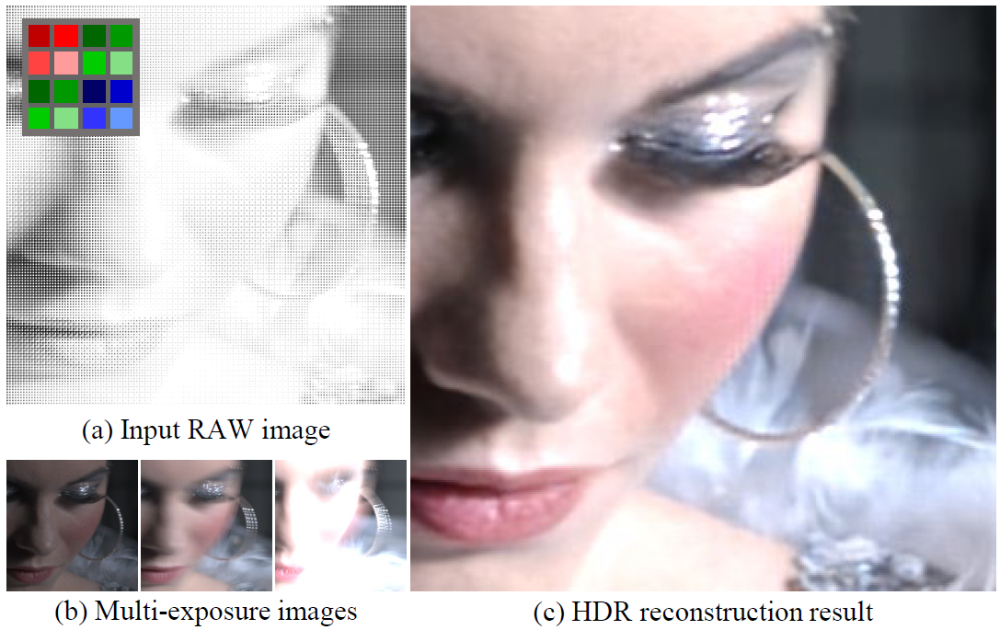

# Demosaicing a Time-Varying Exposures Array for Snapshot HDR Imaging

</img>

Our network restores HDR images from quad Bayer patterned sensor images in an end to end manner.
We create a dataset of quad Bayer sensor input with varying exposures and colors using the existing HDR video dataset.

[Presentation file](https://drive.google.com/file/d/1sJswcXjly7GI8QgXUr1gs9F5Adcq33TW/view?usp=share_link) (Google Drive)

## Results

### Quantitative Results For Synthetic Dataset

</img>

### Qualitative Results For Synthetic Dataset

</img>

### Qualitative Results For Real-world Dataset

</img>

Quantitative and qualitative results of our model. Our model outperforms baseline methods in terms of color reconstruction and denoising, particularly in the area with strong motion blur.

## Methods

</img>

## Installation

This repository is built in Pytorch 1.9.0 and tested on Ubuntu 16.04 enviornment (Python3.7, CUDA10.2, cuDNN7.6).

Or you can just pull official docker image from Dockerhub and istall dependencies:
```
docker pull pytorch/pytorch:1.9.0-cuda10.2-cudnn7-runtime
git clone https://github.com/kimjw0623/HDR_Imaging.git
pip install -r "requirements.txt"
```

Follow these instructions:
1. Clone our repository
```
git clone https://github.com/kimjw0623/HDR_Imaging.git
cd HDR_Imaging
```

2. Make conda enviornment
```
conda create -n pytorch190 python=3.7
conda activate pytorch190
```

3. Install dependencies
```
conda install pytorch==1.9.0 torchvision==0.10.0 torchaudio==0.9.0 cudatoolkit=10.2 -c pytorch
pip install -r "requirements.txt"
```

## Demo
To test pre-trained models, run below code:
```
python test.py
```
