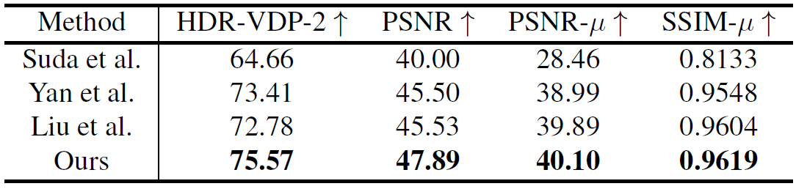
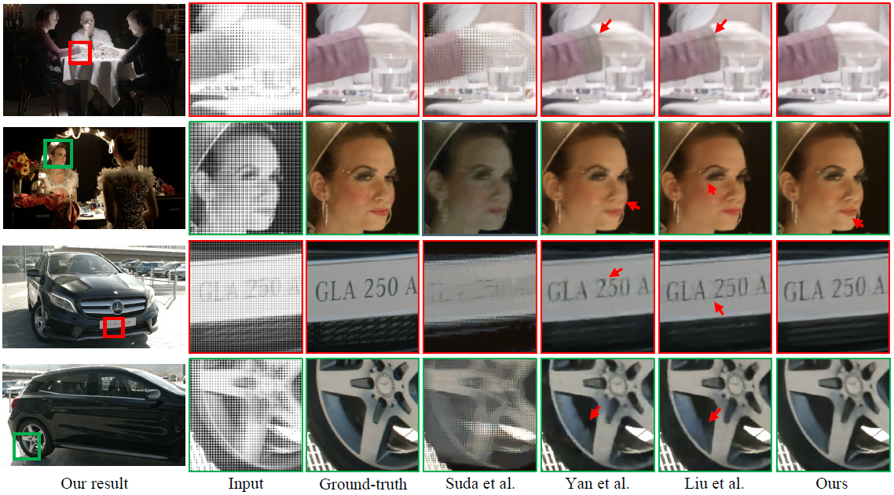
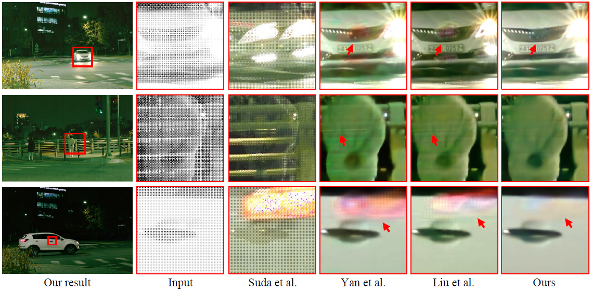
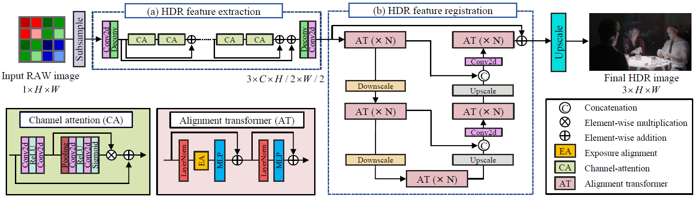

# Demosaicing a Time-Varying Exposures Array for Snapshot HDR Imaging

Our network restores HDR images from quad Bayer patterned sensor images in an end to end manner.
We create a dataset of quad Bayer sensor input with varying exposures and colors using the existing HDR video dataset.

## Results
---

### Quantitative Results For Synthetic Dataset

</img>

### Qualitative Results For Synthetic Dataset

</img>

### Qualitative Results For Real-world Dataset

</img>

Quantitative and qualitative results of our model. Our model outperforms baseline methods in terms of color reconstruction and denoising, particularly in the area with strong motion blur.

## Methods

</img>